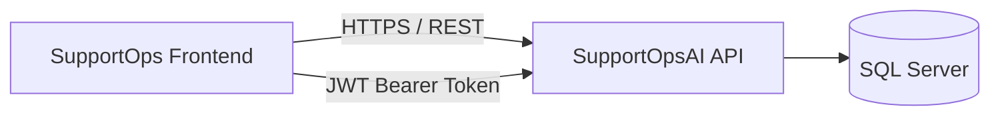

<<<<<<< HEAD
# SupportOps Frontend

A modern, role-aware support ticket management frontend built with **React, TypeScript, Vite, and Tailwind CSS**.

SupportOps Frontend provides a responsive interface for managing support tickets, monitoring ticket activity, communicating through comments, assigning support agents, and tracking ticket history.

The application connects to the **SupportOpsAI REST API** and uses real backend data throughout the core ticket workflow.

---

## Overview

SupportOps Frontend is the client application for the SupportOps support management platform.

The project focuses on providing a clean and practical interface for three different user roles:

- User
- Agent
- Admin

The frontend communicates with the backend through authenticated REST API requests using JWT Bearer authentication.

Core ticket data is loaded directly from the API rather than from mock or hardcoded business data.

---

## Features

### Authentication

- JWT-based authentication
- Login integration with the SupportOpsAI API
- Persistent authenticated session
- Protected application routes
- Automatic Bearer token injection using Axios interceptors
- Role information stored with the authenticated user

### Dashboard

The dashboard provides a real-time overview based on ticket data returned by the API.

It currently includes:

- Open ticket count
- In Progress ticket count
- Resolved ticket count
- Critical ticket count
- Ticket activity chart for the last 7 days
- Ticket distribution by priority
- Recent tickets table

All dashboard metrics are calculated from real ticket data.

### Ticket Management

The Tickets page provides a complete ticket browsing experience with:

- Real API ticket data
- Search by ticket title
- Search by ticket ID
- Status filtering
- Priority filtering
- Category filtering
- Pagination
- Responsive ticket table
- Direct navigation to ticket details

Ticket visibility is controlled by the backend according to the authenticated user's role.

### Ticket Details

Each ticket has a dedicated detail page containing:

- Ticket title
- Description
- Status
- Priority
- Category
- Assigned agent
- Creation date
- Resolution date
- Closed date
- Comments
- Internal notes
- Activity history

The page dynamically loads:

```text
GET /api/tickets/{id}
GET /api/tickets/{id}/comments
GET /api/tickets/{id}/history
```

### Ticket Status Management

Support staff can update ticket status directly from the ticket detail page.

Supported workflow includes:

```text
Open
  ↓
Assigned
  ↓
In Progress
  ↓
Resolved
  ↓
Closed
```

Status transitions remain validated by the backend domain rules.

### Priority Management

Ticket priority can be updated directly from the ticket detail page.

Available priorities:

- Low
- Medium
- High
- Critical

### Agent Assignment

Agents and administrators can assign tickets to active support agents.

The frontend retrieves available agents using:

```text
GET /api/users/agents
```

Agents are displayed by their real names instead of exposing internal GUID values.

Selecting an agent automatically sends the agent ID to the backend:

```text
PATCH /api/tickets/{id}
```

Example request:

```json
{
  "assignedAgentId": "agent-guid"
}
```

### Comments

Users can communicate directly inside each ticket.

Features include:

- Real ticket comments
- Author names
- User initials
- Creation timestamps
- Automatic refresh after submitting a comment

Comments are created through:

```text
POST /api/tickets/{id}/comments
```

### Internal Notes

Agents and administrators can create internal support notes.

Internal notes:

- Are visually differentiated from normal comments
- Can only be created by support staff
- Are hidden from regular users by the backend
- Are recorded in ticket history

### Activity History

Every ticket contains an activity timeline showing important changes such as:

- Ticket created
- Agent assigned
- Priority changed
- Category changed
- Status changed
- Comment added
- Ticket resolved
- Ticket closed

Activity records display the real name of the user who performed the action.

---

## Role-Aware Interface

The frontend adapts available actions based on the authenticated user's role.

| Capability | User | Agent | Admin |
|---|:---:|:---:|:---:|
| Login | ✅ | ✅ | ✅ |
| View authorized tickets | ✅ | ✅ | ✅ |
| Open ticket details | ✅ | ✅ | ✅ |
| Add public comments | ✅ | ✅ | ✅ |
| View public comments | ✅ | ✅ | ✅ |
| Create internal notes | ❌ | ✅ | ✅ |
| View internal notes | ❌ | ✅ | ✅ |
| Assign agents | ❌ | ✅ | ✅ |
| Change ticket status | ❌ | ✅ | ✅ |
| View activity history | ✅ | ✅ | ✅ |

Authorization is ultimately enforced by the backend API.

---

## Tech Stack

### Core

- React
- TypeScript
- Vite

### Styling

- Tailwind CSS

### Routing

- React Router

### API Communication

- Axios

### State Management

- Zustand

### Forms and Validation

- React Hook Form
- Zod
- `@hookform/resolvers`

### Data Visualization

- Recharts

### Icons

- Lucide React

---

## Architecture



The frontend is intentionally separated from the backend.

This repository contains only the React client application.

The backend is maintained separately in:

**SupportOpsAI**

https://github.com/DiegoSandxval/SupportOpsAI

---

## Project Structure

```text
src/
├── api/
│   └── apiClient.ts
│
├── components/
│   ├── auth/
│   │   └── ProtectedRoute.tsx
│   │
│   ├── dashboard/
│   │   ├── PriorityChart.tsx
│   │   ├── RecentTickets.tsx
│   │   ├── StatCard.tsx
│   │   └── TicketActivityChart.tsx
│   │
│   └── layout/
│       ├── AppLayout.tsx
│       ├── Header.tsx
│       └── Sidebar.tsx
│
├── pages/
│   ├── DashboardPage.tsx
│   ├── LoginPage.tsx
│   ├── TicketDetailPage.tsx
│   └── TicketsPage.tsx
│
├── store/
│   └── authStore.ts
│
├── types/
│   ├── auth.ts
│   ├── ticket.ts
│   └── user.ts
│
├── App.tsx
├── index.css
└── main.tsx
```

---

## API Integration

The Axios client is configured using an environment variable:

```env
VITE_API_URL=https://localhost:7277/api
```

The actual API port can be changed depending on the local SupportOpsAI configuration.

Authenticated requests automatically include:

```http
Authorization: Bearer <access-token>
```

---

## API Endpoints Used

### Authentication

```text
POST /api/auth/login
```

### Tickets

```text
GET   /api/tickets
GET   /api/tickets/{id}
PATCH /api/tickets/{id}
```

### Comments

```text
GET  /api/tickets/{id}/comments
POST /api/tickets/{id}/comments
```

### Ticket History

```text
GET /api/tickets/{id}/history
```

### Agents

```text
GET /api/users/agents
```

---

## Getting Started

### Prerequisites

Make sure the following are installed:

- Node.js
- npm
- Git

You also need the SupportOpsAI backend running locally.

---

## Installation

Clone the repository:

```bash
git clone <your-repository-url>
```

Enter the project:

```bash
cd SupportOpsFront
```

Install dependencies:

```bash
npm install
```

---

## Environment Configuration

Create a `.env` file in the root of the project:

```env
VITE_API_URL=https://localhost:7277/api
```

Change the port if your local API uses a different HTTPS port.

---

## Run the Development Server

```bash
npm run dev
```

Vite will start the frontend development server.

The application is typically available at:

```text
http://localhost:5173
```

---

## Production Build

Create an optimized production build:

```bash
npm run build
```

Preview the production build locally:

```bash
npm run preview
```

---

## Authentication Flow

```text
Login Page
    ↓
POST /api/auth/login
    ↓
JWT Access Token
    ↓
Zustand Auth Store
    ↓
localStorage
    ↓
Axios Authorization Header
    ↓
Protected Routes
```

The authenticated user information includes:

```text
ID
Full Name
Email
Role
```

This information is also used to adapt parts of the interface according to the user's permissions.

---

## Ticket Workflow

A typical support workflow looks like this:

```text
User creates ticket
        ↓
Ticket appears in SupportOps
        ↓
Support Agent reviews ticket
        ↓
Agent is assigned
        ↓
Ticket moves to In Progress
        ↓
Comments / Internal Notes
        ↓
Issue is resolved
        ↓
Ticket is closed
```

Every significant operation is recorded by the backend and displayed in the Activity History timeline.

---

## Engineering Highlights

### Real API Data

The primary application workflow does not rely on hardcoded ticket data.

Dashboard statistics, charts, tickets, comments, history, and agents are populated using API responses.

### Typed API Contracts

TypeScript interfaces are used for API models including:

```text
LoginResponse
TicketListItem
TicketDetail
TicketComment
TicketHistoryItem
AgentListItem
```

This keeps the frontend aligned with the backend contracts.

### Centralized Authentication

Authentication state is managed using Zustand while Axios automatically attaches the JWT token to authenticated requests.

### Role-Aware UI

Features such as internal notes, agent assignment, and status management are conditionally available based on the authenticated user's role.

Backend authorization remains the final security boundary.

### Concurrent Data Loading

Ticket details, comments, and history are loaded concurrently using `Promise.all`, reducing unnecessary sequential requests.

### Responsive Design

The application includes a responsive layout designed for desktop and smaller screen sizes.

---

## Current Status

The core support workflow is operational:

```text
Authentication            ✅
Protected routes           ✅
Dashboard                  ✅
Real ticket statistics     ✅
Ticket charts              ✅
Ticket listing             ✅
Search and filters         ✅
Pagination                 ✅
Ticket details             ✅
Priority updates           ✅
Status updates             ✅
Agent assignment           ✅
Comments                   ✅
Internal notes             ✅
Activity history           ✅
Real user names            ✅
```

---

## Roadmap

Planned improvements include:

- User management interface
- Dedicated My Tickets experience
- Analytics dashboard
- Ticket creation interface improvements
- AI-assisted ticket analysis integration
- Additional loading and success feedback
- Better global error handling
- Toast notifications
- Advanced ticket filters
- Server-side pagination
- Automated frontend tests
- Deployment configuration

---

## Backend

SupportOps Frontend is designed to work with the SupportOpsAI backend.

Backend repository:

https://github.com/DiegoSandxval/SupportOpsAI

The backend is built with ASP.NET Core and provides authentication, authorization, ticket management, comments, history, agent management, persistence, and additional support automation capabilities.

---

## Project Goals

SupportOps was built to demonstrate a production-style full-stack support management workflow, including:

- Separation between frontend and backend
- REST API integration
- JWT authentication
- Role-based authorization
- Typed frontend development
- State management
- Responsive user interfaces
- Domain-driven ticket workflows
- Real persistence-backed data
- Maintainable application structure

---

## Disclaimer

This project is currently under active development and is intended as a software engineering portfolio project.

Additional modules and improvements will continue to be added as the platform evolves.
=======
# React + TypeScript + Vite

This template provides a minimal setup to get React working in Vite with HMR and some ESLint rules.

Currently, two official plugins are available:

- [@vitejs/plugin-react](https://github.com/vitejs/vite-plugin-react/blob/main/packages/plugin-react) uses [Oxc](https://oxc.rs)
- [@vitejs/plugin-react-swc](https://github.com/vitejs/vite-plugin-react/blob/main/packages/plugin-react-swc) uses [SWC](https://swc.rs/)

## React Compiler

The React Compiler is not enabled on this template because of its impact on dev & build performances. To add it, see [this documentation](https://react.dev/learn/react-compiler/installation).

## Expanding the ESLint configuration

If you are developing a production application, we recommend updating the configuration to enable type-aware lint rules:

```js
export default defineConfig([
  globalIgnores(['dist']),
  {
    files: ['**/*.{ts,tsx}'],
    extends: [
      // Other configs...

      // Remove tseslint.configs.recommended and replace with this
      tseslint.configs.recommendedTypeChecked,
      // Alternatively, use this for stricter rules
      tseslint.configs.strictTypeChecked,
      // Optionally, add this for stylistic rules
      tseslint.configs.stylisticTypeChecked,

      // Other configs...
    ],
    languageOptions: {
      parserOptions: {
        project: ['./tsconfig.node.json', './tsconfig.app.json'],
        tsconfigRootDir: import.meta.dirname,
      },
      // other options...
    },
  },
])

```

You can also install [eslint-plugin-react-x](https://github.com/Rel1cx/eslint-react/tree/main/packages/plugins/eslint-plugin-react-x) and [eslint-plugin-react-dom](https://github.com/Rel1cx/eslint-react/tree/main/packages/plugins/eslint-plugin-react-dom) for React-specific lint rules:

```js
// eslint.config.js
import reactX from 'eslint-plugin-react-x'
import reactDom from 'eslint-plugin-react-dom'

export default defineConfig([
  globalIgnores(['dist']),
  {
    files: ['**/*.{ts,tsx}'],
    extends: [
      // Other configs...
      // Enable lint rules for React
      reactX.configs['recommended-typescript'],
      // Enable lint rules for React DOM
      reactDom.configs.recommended,
    ],
    languageOptions: {
      parserOptions: {
        project: ['./tsconfig.node.json', './tsconfig.app.json'],
        tsconfigRootDir: import.meta.dirname,
      },
      // other options...
    },
  },
])

```
>>>>>>> ab36356 (First Commit)
